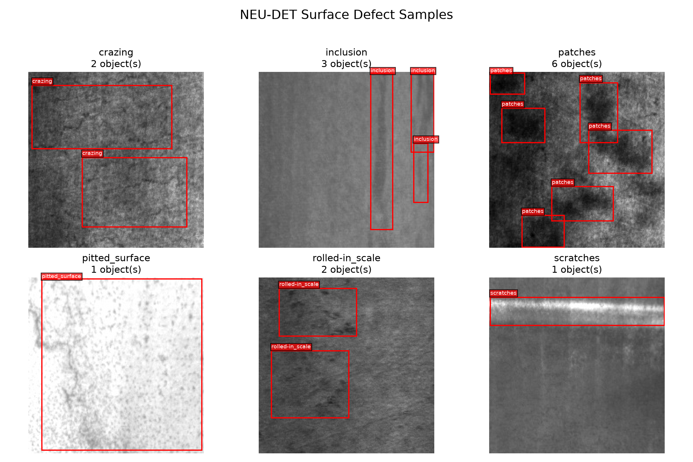
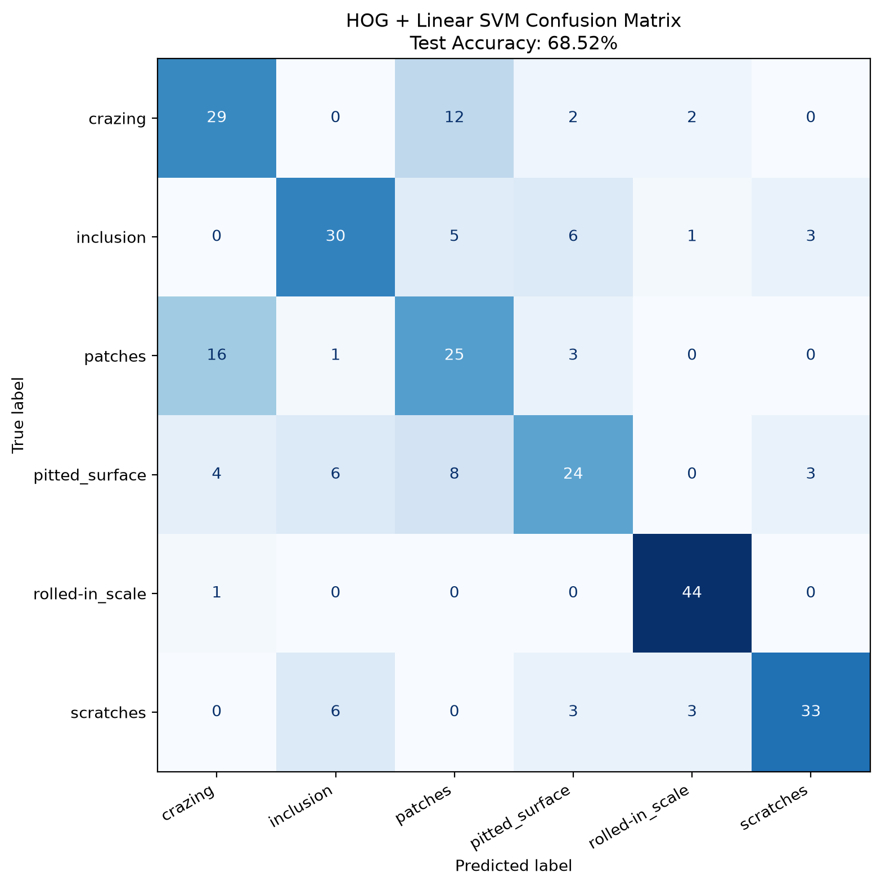
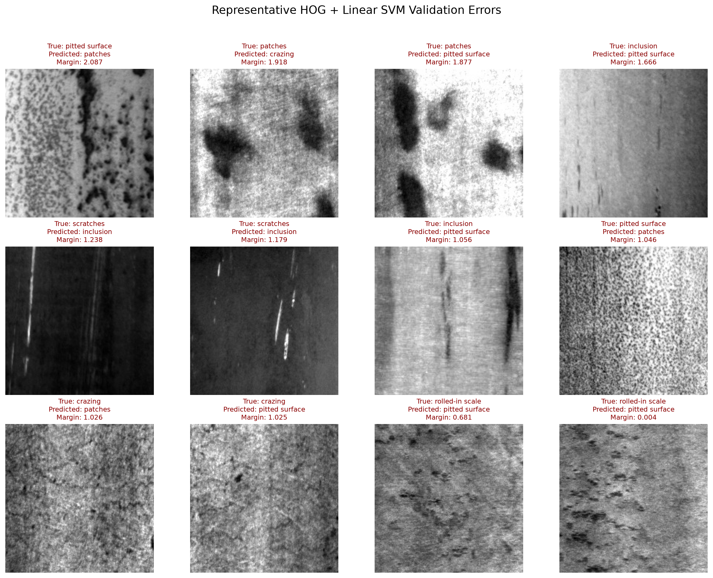
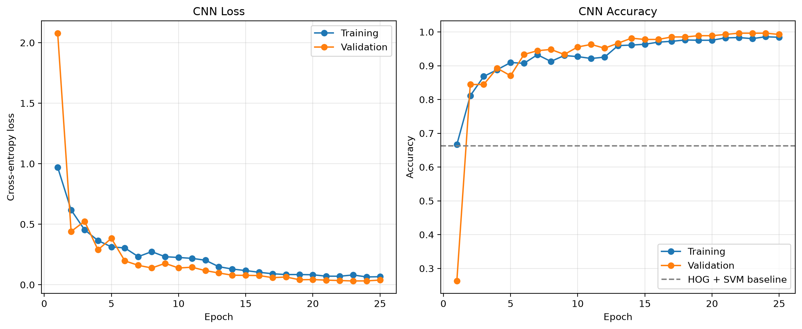
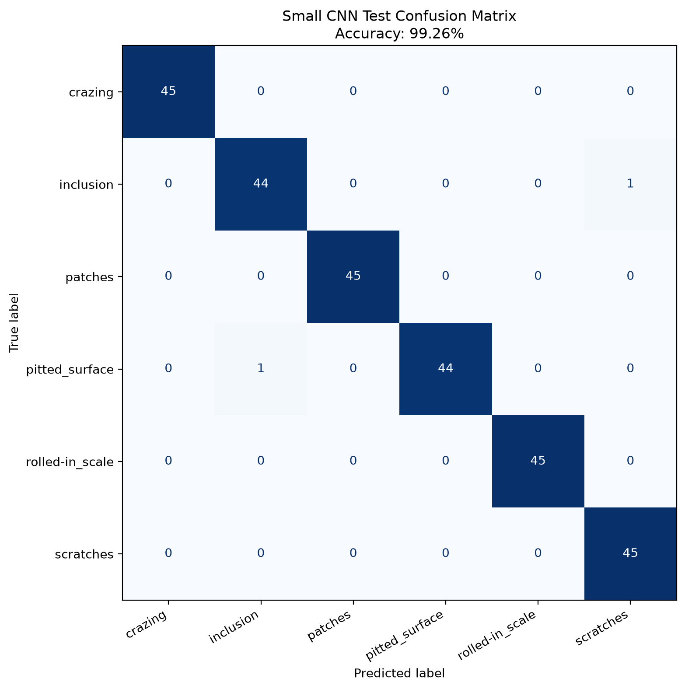
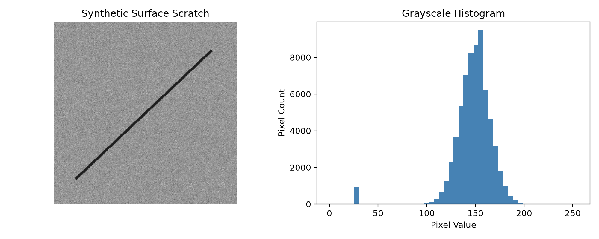
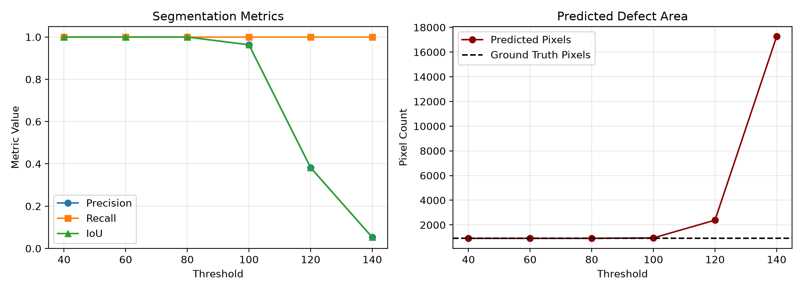

# Materials Surface Defect Detection

A reproducible computer vision project for metallic surface defect analysis using classical image processing, machine learning, and deep learning.

The project is developed from a materials science perspective and aims to connect material defect mechanisms with intelligent perception algorithms.

## Project Motivation

Surface defects such as scratches, inclusions, cracks, pits, and oxide scales can affect the appearance, mechanical performance, and service reliability of metallic materials.

The goal of this project is to build a reproducible workflow for:

- surface image analysis;
- defect dataset auditing and visualization;
- image classification;
- object detection;
- comparison between classical and deep-learning methods.

## Dataset

The project uses the NEU-DET metallic surface defect dataset.

It contains 1,800 grayscale surface images divided equally into six classes:

| Class | Images |
|---|---:|
| Crazing | 300 |
| Inclusion | 300 |
| Patches | 300 |
| Pitted surface | 300 |
| Rolled-in scale | 300 |
| Scratches | 300 |
| **Total** | **1,800** |

The dataset also contains 1,800 Pascal VOC XML annotation files with 4,189 defect bounding boxes.

Raw dataset files are excluded from Git because of their size and redistribution considerations.

Expected local directory structure:

```text
data/raw/NEU-DET/
|-- IMAGES/
|   |-- crazing_1.jpg
|   |-- inclusion_1.jpg
|   `-- ...
`-- ANNOTATIONS/
    |-- crazing_1.xml
    |-- inclusion_1.xml
    `-- ...
```

## Dataset Audit

The audit script verifies:

- image and annotation counts;
- image–annotation pairing;
- image dimensions and channels;
- annotation class names;
- bounding-box validity;
- missing or corrupted files.

Audit result:

```text
Images: 1800
Annotations: 1800
Paired samples: 1800
Missing annotations: 0
Missing images: 0
Problems: 0
```



## Reproducible Dataset Split

The dataset is divided using a stratified split with random seed 42:

| Split | Images per class | Total |
|---|---:|---:|
| Training | 210 | 1,260 |
| Validation | 45 | 270 |
| Test | 45 | 270 |

The generated split fingerprint is:

```text
59c6471cba3672f9677b769da153ce3b87253066807869cfde51c2b47f72393c
```

The three subsets have zero overlapping samples and cover all 1,800 images.

## Classical Classification Baseline

A traditional machine-learning baseline was established using:

1. grayscale conversion;
2. resizing to \(128 \times 128\);
3. Histogram of Oriented Gradients (HOG) feature extraction;
4. linear Support Vector Machine (SVM) classification.

Each image is represented by an 8,100-dimensional HOG feature vector.

### Baseline Results

| Metric | Result |
|---|---:|
| Validation accuracy | 66.30% |
| Test accuracy | 68.52% |
| Macro precision | 68.92% |
| Macro recall | 68.52% |
| Macro F1-score | 68.48% |

Per-class test results:

| Class | Precision | Recall | F1-score |
|---|---:|---:|---:|
| Crazing | 58.00% | 64.44% | 61.05% |
| Inclusion | 69.77% | 66.67% | 68.18% |
| Patches | 50.00% | 55.56% | 52.63% |
| Pitted surface | 63.16% | 53.33% | 57.83% |
| Rolled-in scale | 88.00% | 97.78% | 92.63% |
| Scratches | 84.62% | 73.33% | 78.57% |



The most obvious confusion occurs between crazing and patches. This indicates that fixed HOG features cannot fully represent complex and visually similar defect textures, motivating the later introduction of deep neural networks.

### Validation Error Analysis

Validation-set failure cases were analyzed without using the test set for model selection.



The most frequent error directions were:

- patches predicted as crazing: 13 images;
- inclusion predicted as pitted surface: 12 images;
- patches predicted as pitted surface: 12 images;
- pitted surface predicted as patches: 12 images;
- scratches predicted as inclusion: 7 images.

Crazing, patches, and pitted surfaces can all contain irregular and spatially distributed textures. Their local gradient patterns may therefore appear similar to HOG. Some scratches are fragmented rather than continuous, making them locally similar to elongated inclusions.

Several incorrect predictions also have large decision margins. This indicates that the model is not merely uncertain; its manually designed feature representation can confidently encode misleading similarities. These failure cases motivate the use of convolutional neural networks for learning more discriminative spatial and texture features.

## CNN Classification

A compact convolutional neural network was trained from scratch to learn defect features directly from grayscale images.

The network contains:

- six convolutional layers;
- batch normalization and ReLU activation;
- three max-pooling layers;
- global adaptive average pooling;
- dropout regularization;
- a six-class linear classifier.

The model has 288,102 trainable parameters. Training images were augmented using random horizontal flipping, vertical flipping, and small rotations. The model was optimized using AdamW and cross-entropy loss.

Only the training and validation splits were used for model development. The checkpoint with the highest validation accuracy was selected, and the test split was evaluated once after the configuration was fixed.

### Training Results

The best checkpoint was obtained at epoch 22:

| Metric | Result |
|---|---:|
| Best validation accuracy | 99.63% |
| Test accuracy | 99.26% |
| Test macro F1-score | 99.26% |
| Test images correctly classified | 268 / 270 |



### Comparison with the Classical Baseline

| Model | Validation accuracy | Test accuracy |
|---|---:|---:|
| HOG + Linear SVM | 66.30% | 68.52% |
| Small CNN | **99.63%** | **99.26%** |

The CNN improves test accuracy by 30.74 percentage points over the HOG and linear SVM baseline.



Only two test images were misclassified:

- `inclusion_283` was predicted as scratches;
- `pitted_surface_198` was predicted as inclusion.

The result demonstrates that learned convolutional features are substantially more discriminative than fixed HOG features on the NEU-DET random split. However, this result represents same-dataset performance and does not yet demonstrate generalization to different materials, cameras, illumination conditions, or production lines.

## Synthetic Scratch Experiment

Before using the real dataset, a controlled synthetic scratch experiment was conducted to explain basic image representation, threshold segmentation, Precision, Recall, and Intersection over Union.



A pixel is classified as a scratch when:

$$
M(x,y)=
\begin{cases}
1, & I(x,y)<T \\
0, & I(x,y)\geq T
\end{cases}
$$



The experiment demonstrates that fixed thresholds work under controlled grayscale conditions but are sensitive to background texture and intensity variation.

## Project Structure

```text
materials-defect-detection/
|-- data/
|   |-- raw/                 # Local raw dataset, ignored by Git
|   |-- sample/              # Synthetic sample data
|   `-- splits/              # Reproducible train/val/test manifests
|-- outputs/
|   |-- figures/             # Visual results
|   |-- masks/               # Segmentation masks
|   |-- models/              # Trained model checkpoints
|   `-- metrics/             # Numerical experiment results
|-- src/
|   |-- analyze_image.py
|   |-- create_neu_splits.py
|   |-- create_sample_image.py
|   |-- inspect_neu_dataset.py
|   |-- segment_scratch.py
|   |-- threshold_experiment.py
|   |-- train_classical_baseline.py
|   |-- evaluate_cnn_classifier.py
|   `-- train_cnn_classifier.py
|   `-- visualize_neu_samples.py
|-- requirements.txt
`-- README.md
```

## Reproduction

Clone the repository:

```powershell
git clone https://github.com/Arrivers/materials-defect-detection.git
cd materials-defect-detection
```

Create and activate a Python 3.12 virtual environment:

```powershell
py -3.12 -m venv .venv
.\.venv\Scripts\Activate.ps1
```

Install dependencies:

```powershell
python -m pip install -r requirements.txt
```

After placing NEU-DET in the expected local directory, run:

```powershell
python src/inspect_neu_dataset.py
python src/visualize_neu_samples.py
python src/create_neu_splits.py
python src/train_classical_baseline.py
```

## Current Limitations

- The classification baseline uses image-level labels rather than bounding-box locations.
- HOG features are manually designed and have limited ability to represent complex defect textures.
- The dataset is relatively small and contains only six defect classes.
- The dataset does not provide acquisition-group metadata, so capture-level independence cannot be fully verified.
- Generalization to other materials, production lines, illumination conditions, and imaging systems has not yet been evaluated.
- The object-detection stage is not yet complete.

## Roadmap

- [x] Build a reproducible Python environment
- [x] Implement synthetic scratch segmentation
- [x] Conduct a threshold sensitivity experiment
- [x] Audit and visualize the NEU-DET dataset
- [x] Create a deterministic stratified dataset split
- [x] Build a HOG and linear SVM classification baseline
- [x] Analyze baseline failure cases
- [x] Build a convolutional neural network classifier
- [ ] Train an object-detection model using bounding-box annotations
- [ ] Compare classical and deep-learning methods
- [ ] Evaluate model limitations and generalization

## Author

Materials science student developing skills in computer vision, intelligent perception, and artificial intelligence.