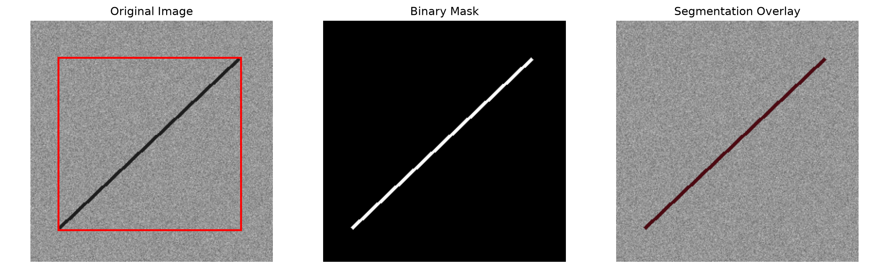

# Materials Surface Defect Detection

A reproducible computer vision project for metallic material surface defect analysis.

This project combines a materials science background with image processing, intelligent perception, and deep learning. The current stage establishes a classical image-processing baseline using synthetic surface scratches.

## Project Motivation

Surface defects such as scratches, inclusions, cracks, and pits can affect the appearance, mechanical performance, and service reliability of metallic materials.

The long-term goal of this project is to explore reproducible computer vision methods for automatic material surface defect detection.

## Current Workflow

1. Generate a reproducible synthetic material surface image.
2. Read the image as a numerical matrix.
3. Analyze its grayscale distribution.
4. Segment the scratch using a fixed threshold.
5. Measure the defect area and bounding box.
6. Compare segmentation performance under different thresholds.

## Image Analysis

The synthetic image contains a dark scratch on a noisy grayscale surface.


The image is represented as a \(256 \times 256\) unsigned 8-bit matrix. Most background pixels are concentrated near a grayscale value of 150, while the scratch pixels have a grayscale value of 30.

## Threshold-Based Segmentation

A pixel is classified as a scratch when its grayscale value is lower than the threshold:

\[
M(x,y)=
\begin{cases}
1,&I(x,y)<T\\
0,&I(x,y)\ge T
\end{cases}
\]

Using \(T=80\), the program identifies 913 scratch pixels, corresponding to 1.39% of the image area.



The binary mask provides pixel-level defect information, while the bounding box provides an approximate defect location.

## Threshold Sensitivity Experiment

The thresholds \(40,60,80,100,120,140\) were evaluated using Precision, Recall, and Intersection over Union (IoU).


### Main Findings

- Thresholds from 40 to 80 achieve perfect segmentation on the synthetic image.
- Increasing the threshold above 80 introduces false-positive background pixels.
- Recall remains 1.0 because every tested threshold is greater than the scratch grayscale value of 30.
- Precision and IoU decrease rapidly as the predicted defect area expands.
- A fixed threshold works under controlled grayscale conditions but may fail under real illumination and texture variations.

Detailed numerical results are available in:

```text
outputs/metrics/threshold_results.csv
```

## Project Structure

```text
materials-defect-detection/
├── data/
│   └── sample/
│       ├── synthetic_scratch.png
│       └── synthetic_scratch_ground_truth.png
├── outputs/
│   ├── figures/
│   ├── masks/
│   └── metrics/
├── src/
│   ├── analyze_image.py
│   ├── check_environment.py
│   ├── create_sample_image.py
│   ├── project_intro.py
│   ├── segment_scratch.py
│   └── threshold_experiment.py
├── requirements.txt
└── README.md
```

## Reproduction

Clone the repository:

```powershell
git clone https://github.com/Arrivers/materials-defect-detection.git
cd materials-defect-detection
```

Create and activate a Python 3.12 virtual environment:

```powershell
py -3.12 -m venv .venv
.\.venv\Scripts\Activate.ps1
```

Install the required packages:

```powershell
python -m pip install -r requirements.txt
```

Run the workflow:

```powershell
python src/create_sample_image.py
python src/analyze_image.py
python src/segment_scratch.py
python src/threshold_experiment.py
```

## Current Limitations

- The current image is synthetic rather than experimental data.
- The scratch has a fixed intensity and simple geometry.
- The threshold is selected manually.
- Real metallic surfaces may contain uneven illumination, reflections, complex textures, and multiple defect types.
- The current method cannot generalize to unseen real-world defects.

## Roadmap

- [x] Build a reproducible Python environment
- [x] Generate and analyze a synthetic surface image
- [x] Perform threshold-based scratch segmentation
- [x] Conduct a threshold sensitivity experiment
- [ ] Introduce a real metallic surface defect dataset
- [ ] Perform dataset exploration and visualization
- [ ] Build a classification baseline
- [ ] Train an object detection model
- [ ] Compare classical and deep-learning methods
- [ ] Analyze failure cases and model limitations

## Author

Materials science student developing skills in computer vision, intelligent perception, and artificial intelligence.